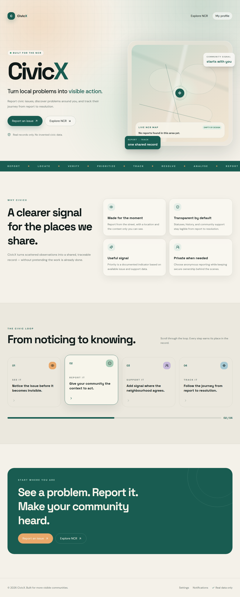
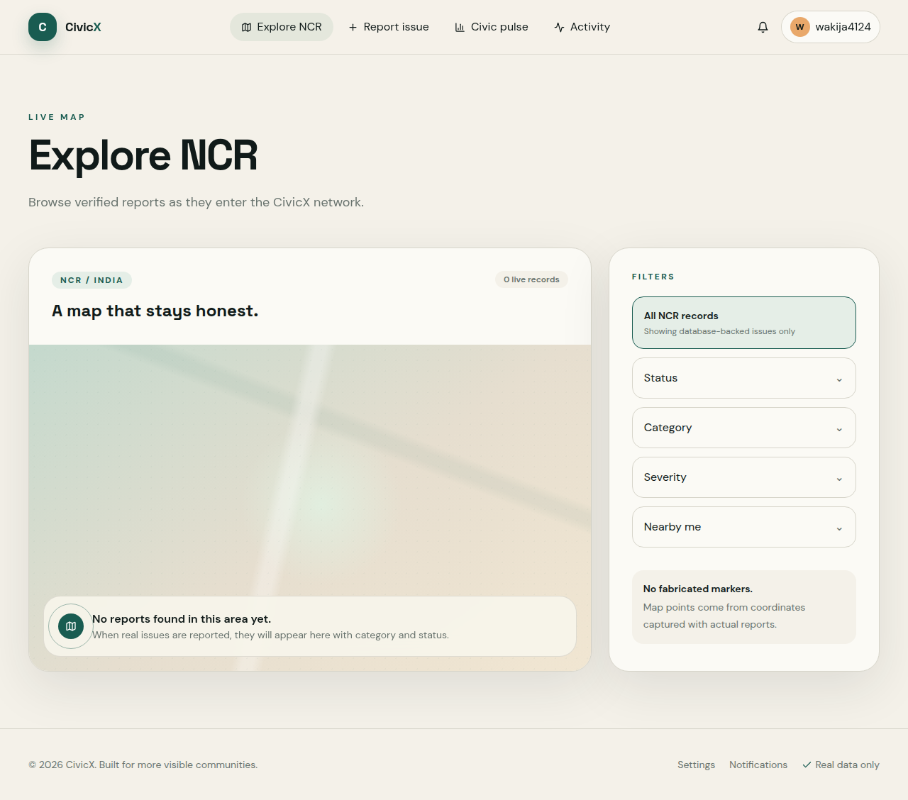
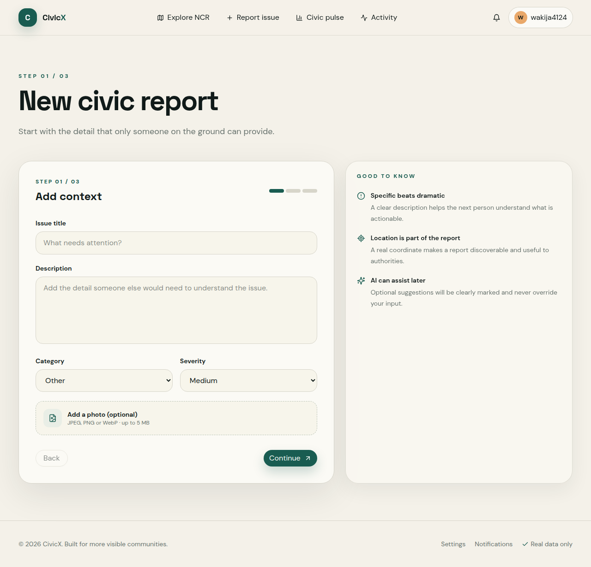
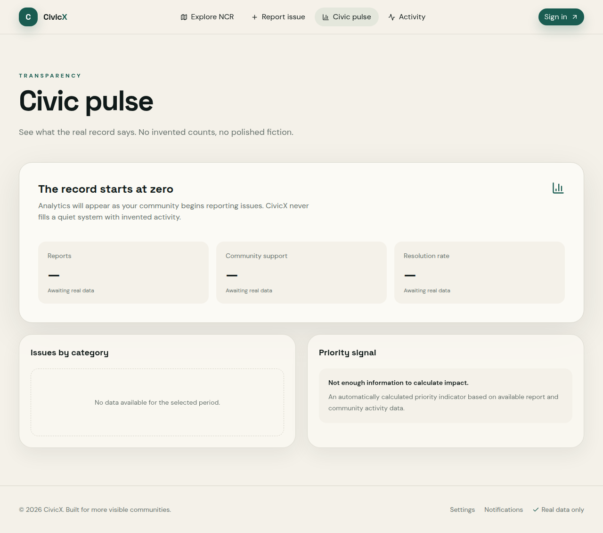

<p align="center">

</p> <h1 align="center">CivicX</h1> <p align="center"><strong>Turn local problems into visible action.</strong></p> <p align="center">
  <a href="https://civicintel-gkvdzzdx.manus.space">Live website</a>
  ·
  <a href="https://github.com/thakurakshat1008-coder/civicx">Source repository</a>
</p> <p align="center">
  
  
  
  
</p>

CivicX is a civic intelligence and community problem-reporting platform designed for the National Capital Region of India. It gives residents a clear path from noticing a local issue to creating a location-aware public record that can be supported, tracked, prioritized, and resolved transparently.

> **See a problem. Report it. Make your community heard.**

CivicX is intentionally honest: the application begins with an empty database and never manufactures complaints, users, map markers, statistics, authorities, support counts, activity, notifications, or resolution records to make the interface look populated.

---

## Contents

- [Product overview](#product-overview)

- [Visual tour](#visual-tour)

- [Why CivicX](#why-civicx)

- [Core capabilities](#core-capabilities)

- [Civic workflow](#civic-workflow)

- [Data integrity by design](#data-integrity-by-design)

- [Architecture](#architecture)

- [Technology](#technology)

- [Application routes](#application-routes)

- [Reporting flow](#reporting-flow)

- [Analytics and priority](#analytics-and-priority)

- [Privacy and authorization](#privacy-and-authorization)

- [Local development](#local-development)

- [Project structure](#project-structure)

- [Roadmap](#roadmap)

- [Contribution guide](#contribution-guide)

- [Acknowledgements](#acknowledgements)

---

## Product overview

CivicX is built around a simple premise: civic problems become easier to act on when the report is specific, discoverable, supported by the community, and transparent about what has happened since it was created.

The platform initially focuses on the NCR region and is designed to support Delhi, Gurugram, Noida, Greater Noida, Ghaziabad, Faridabad, and other relevant NCR areas without hardcoding issue coordinates or fabricated regional data. Coordinates are captured from browser geolocation or a legitimate user-selected location and stored with the report.

CivicX is not presented as an official government platform. It is a civic technology product that helps residents, students, community groups, and authorized civic teams create a clearer shared record.

### The promise

| Before CivicX | With CivicX |
| --- | --- |
| A local issue stays isolated in a conversation | A report can become a visible, location-aware civic record |
| Residents cannot easily see whether a problem is already known | Nearby issues can be searched, filtered, and explored |
| Progress is difficult to follow | Status history makes the journey legible |
| Community concern is hard to measure | Real support activity can inform a documented priority signal |
| Dashboards often hide whether a number is real | Empty states make the absence of data explicit |

---

## Visual tour

The following screenshots are captured from the current CivicX website. They show the actual product surfaces and the intentional empty-database state. They are included here as a visual preview, not as fabricated civic activity.

### 1. Landing page

The landing page introduces the CivicX model through a premium editorial interface: warm ivory surfaces, deep civic green, amber accents, responsive motion, and a map visual that makes the product direction immediately understandable without inventing reports.



### 2. Interactive NCR map

The map view is built around a legitimate Google Maps integration and database-backed issue markers. When no real issues exist, it displays a calm empty state instead of fake markers or artificial map activity.



### 3. Guided report form

The multi-step report flow helps a resident add context, choose a category and severity, upload an optional image, capture their current location, select privacy preferences, and submit a real record.



### 4. Civic pulse analytics

The analytics surface is designed to be transparent from its first record. When the database is empty, the dashboard explains that analytics will appear as the community begins reporting issues and shows no invented chart bars.



---

## Why CivicX

### 1. It makes local problems visible without overstating impact

CivicX does not claim that a priority score represents an exact number of people affected. Community Impact is framed as an automatically calculated indicator based on available report and community activity data. If the platform does not have enough information, it says so.

### 2. It connects reports to place

Location is a first-class part of a CivicX record. Residents can request their current browser location or provide a location label while selecting a position on the map. This turns an abstract complaint into a record that can be found, grouped, and acted upon geographically.

### 3. It keeps progress traceable

A report starts as `REPORTED`, may move to `IN_PROGRESS`, and can become `RESOLVED` only through an authorized status change. Every status change creates an immutable history record with the previous status, new status, user, timestamp, and optional note.

### 4. It creates a healthier signal for civic teams

A civic team does not need another dashboard full of decorative numbers. CivicX is designed to surface the records that actually exist, show community support, and make the reasoning behind a priority indicator visible.

### 5. It respects privacy

Residents can report anonymously for public visibility while the application retains secure internal ownership where required for notifications, account history, and authorization. Public-facing content does not expose private user identity by default.

### 6. It is designed to grow

The architecture leaves room for multiple cities, ward-level analytics, municipal department integrations, public APIs, SMS and email notifications, advanced geospatial analysis, duplicate detection, and future mobile clients.

---

## Core capabilities

### Public experience

- Premium landing page explaining the civic loop.

- Responsive navigation for desktop and mobile.

- NCR-focused map view.

- Legitimate map integration with real report coordinates.

- Search-ready issue listing architecture.

- Clear issue category and severity language.

- Honest empty states for maps, activity, analytics, notifications, and profiles.

- Public issue detail route structure.

- Community activity feed driven by real application events.

### Reporting

- Authenticated multi-step report flow.

- Issue title and description validation.

- Civic category selection.

- Severity selection from `Low`, `Medium`, `High`, or `Critical`.

- Optional image upload with file type and size validation.

- Secure storage through the built-in storage service.

- Browser geolocation with graceful permission-denied and unavailable states.

- Location label capture.

- Anonymous public visibility option.

- Notification created after successful submission.

- Activity event created after successful submission.

### Community support

- One support record per user and issue.

- Duplicate support prevented at the database level.

- Support can be removed.

- Support activity becomes part of the live activity feed.

- Support counts are queried from the database.

### Authority workflows

- Role-gated status changes for authorized users.

- Status progression from reported to in progress to resolved.

- Immutable status-history records.

- Optional status note.

- Notifications sent to the issue owner after a status change.

- Activity events recorded for status changes and resolution.

### Profiles and notifications

- User profile route.

- My reports view structure.

- My support view structure.

- Notification view structure.

- Secure sign-in through Manus OAuth.

- Logout flow.

- Privacy-oriented settings surface.

### Analytics

- Database-backed total issue count.

- Reported, in-progress, and resolved counts.

- Critical issue count.

- Community support total.

- Issues by category.

- Issues by status.

- Resolution rate calculation.

- Empty-state handling when no records exist.

- Priority signal explanation.

---

## Civic workflow

CivicX expresses the product as a visible civic loop:

```
REPORT → LOCATE → VERIFY → PRIORITIZE → TRACK → RESOLVE → ANALYSE
```

### 1. Report

A resident describes a real issue and optionally attaches a real image from the place where it was observed.

### 2. Locate

The report captures a location through browser geolocation or user-selected map context. Coordinates are stored with the report; they are never inferred from a fabricated marker.

### 3. Verify

The architecture supports future authority verification and moderation workflows while preserving the distinction between user-reported information, AI-generated suggestions, and authority-verified facts.

### 4. Prioritize

Community support, severity, recency, repeated reports, and other documented attributes can contribute to a priority indicator. The indicator is explanatory, not a claim of exact affected population.

### 5. Track

Residents can follow a report through its current status and status history. Notifications are created from real application events.

### 6. Resolve

Only an authorized status change can mark a report resolved. Resolution evidence can be extended to support genuine before/after images, notes, and timestamps.

### 7. Analyse

Analytics query the database. If there are no records for the selected period, the interface shows that no data is available instead of rendering invented bars.

---

## Data integrity by design

CivicX has a strict no-fabrication rule.

The initial database is empty. The product does not seed demonstration complaints, sample users, fake authorities, placeholder coordinates, fake support counts, fabricated charts, simulated activity, or artificial notifications.

Every civic-facing value must originate from one of the following:

1. A real database record created through the application.

1. A legitimate map or geolocation service.

1. A user-uploaded file stored through secure storage.

1. An authorized status transition.

1. A transparent calculation over records that actually exist.

The interface uses meaningful empty states to explain what will appear once real activity begins:

- **Map:** “No reports found in this area yet.”

- **Analytics:** “Analytics will appear as your community begins reporting issues.”

- **Activity:** “No community activity yet.”

- **Profile:** “Your reports, support, and unlocked milestones will appear as your account earns them.”

- **Priority:** “Not enough information to calculate impact.”

This principle is important for civic products because a polished false signal can be more harmful than an empty screen.

---

## Architecture

CivicX uses a modular full-stack structure with typed contracts between the client and server.

```
┌─────────────────────────────────────────────────────────┐
│                    CivicX Web Client                    │
│ React 19 · TypeScript · Vite · Tailwind CSS             │
│ Wouter routes · Framer Motion · Lucide icons            │
└───────────────────────────────┬─────────────────────────┘
                                │ tRPC
┌───────────────────────────────▼─────────────────────────┐
│                    CivicX Application Server             │
│ Express · tRPC · auth context · role checks             │
│ report procedures · support procedures · analytics       │
└───────────────┬───────────────────┬────────────────────┘
                │                   │
┌───────────────▼────────────┐ ┌────▼─────────────────────┐
│ MySQL / TiDB via Drizzle   │ │ Secure object storage     │
│ users · issues · upvotes   │ │ report images             │
│ history · activities       │ │ resolution evidence       │
│ notifications              │ └──────────────────────────┘
└────────────────────────────┘
                │
┌───────────────▼─────────────────────────────────────────┐
│ External platform services                               │
│ Manus OAuth · Google Maps proxy · optional LLM support  │
└─────────────────────────────────────────────────────────┘
```

### Server-side responsibilities

- Authentication context and user ownership.

- Role-based procedure protection.

- Database reads and writes through Drizzle.

- Duplicate-support prevention.

- Status history creation.

- Notification creation.

- Activity creation.

- Secure image upload mediation.

- Analytics aggregation.

### Client-side responsibilities

- Responsive product UI.

- Report flow state.

- Browser geolocation permission handling.

- Image preview before upload.

- Live map presentation.

- Empty, loading, success, and error states.

- Profile and dashboard surfaces.

---

## Technology

| Layer | Technology |
| --- | --- |
| Frontend | React 19, TypeScript, Vite |
| Styling | Tailwind CSS, custom CSS variables, responsive design tokens |
| Components | shadcn/ui primitives, Lucide React |
| Motion | Framer Motion-ready architecture, CSS GPU-safe transitions, reduced-motion support |
| Routing | Wouter |
| API | tRPC 11 |
| Server | Express 4, Node.js |
| Database | MySQL / TiDB through Drizzle ORM |
| Authentication | Manus OAuth |
| Storage | Built-in secure object storage |
| Mapping | Google Maps proxy integration |
| Testing | Vitest, TypeScript checks |
| Deployment | Managed WebDev runtime |

---

## Application routes

| Route | Purpose | Access |
| --- | --- | --- |
| `/` | Product landing page | Public |
| `/map` | Explore real NCR issue records | Public |
| `/report` | Reporting introduction | Public |
| `/report/new` | Multi-step issue creation flow | Authenticated |
| `/issues/:id` | Public issue detail structure | Public |
| `/analytics` | Transparent civic analytics | Public |
| `/activity` | Real community activity feed | Public |
| `/profile` | User contribution view | Authenticated |
| `/notifications` | User-specific notifications | Authenticated |
| `/dashboard` | Authority command-center surface | Role-gated foundation |
| `/login` | Secure sign-in entry | Public |
| `/register` | Secure profile entry | Public |
| `/settings` | Privacy and account settings | Authenticated |

---

## Reporting flow

The reporting flow is intentionally progressive so residents can provide enough information without facing a giant form.

### Step 01 — Add context

- Issue title.

- Description with minimum length validation.

- Civic category.

- Severity.

- Optional image upload.

- Client-side image preview.

- File type validation.

- Five-megabyte image size limit.

### Step 02 — Pin the place

- Use my current location.

- Browser permission handling.

- Location unavailable handling.

- Manual location label fallback.

- Coordinate display for transparency.

- Map-backed location context.

### Step 03 — Privacy and submit

- Anonymous public visibility option.

- Secure ownership through authentication.

- Final report summary.

- Database write.

- Notification creation.

- Activity creation.

Optional AI assistance can be added on top of this flow without becoming a single point of failure. Any AI-generated suggestion should remain explicitly labeled and editable by the resident.

---

## Analytics and priority

CivicX uses database-backed analytics rather than presentation-layer placeholders.

### Current metrics

- Total issues reported.

- Issues currently reported.

- Issues in progress.

- Resolved issues.

- Critical issues.

- Community support actions.

- Category breakdown.

- Status breakdown.

- Resolution rate.

### Priority principle

A future priority queue can combine the following available attributes:

- Severity.

- Community support.

- Age of report.

- Repeated reports.

- Status.

- Location context.

Every priority item should include an explanation derived from actual attributes, such as:

> High severity + strong community support.

The product should never imply that the score is an exact count of affected people.

---

## Privacy and authorization

CivicX separates public visibility from secure ownership.

- Anonymous reports hide the reporter identity publicly.

- Authenticated ownership remains available to the application for notifications and personal history.

- Support actions require authentication.

- Status changes require an authorized role.

- Status transitions are stored in immutable history records.

- Administrative actions are not exposed to ordinary users.

- Image uploads are stored through the secure storage layer instead of database blobs.

- The product does not claim official government endorsement.

---

## Local development

This repository is built from the WebDev full-stack scaffold. The exact environment variables are provided by the managed runtime and should not be committed to source control.

### Prerequisites

- Node.js 22 or later.

- pnpm 10 or later.

- Access to the configured database and authentication environment.

### Install

```bash
pnpm install
```

### Run the development server

```bash
pnpm dev
```

### Typecheck

```bash
pnpm check
```

### Run tests

```bash
pnpm test
```

### Build for production

```bash
pnpm build
```

### Database workflow

The schema lives in `drizzle/schema.ts`. Generate migrations with:

```bash
pnpm drizzle-kit generate
```

Review the generated migration before applying it to a connected database. Do not insert fabricated civic records to test an empty-state interface.

---

## Project structure

```
civicx/
├── client/
│   ├── public/
│   └── src/
│       ├── components/
│       ├── contexts/
│       ├── hooks/
│       ├── lib/
│       ├── pages/
│       ├── App.tsx
│       └── index.css
├── drizzle/
│   ├── migrations/
│   ├── relations.ts
│   └── schema.ts
├── server/
│   ├── _core/
│   ├── db.ts
│   ├── routers.ts
│   └── storage.ts
├── shared/
├── package.json
├── tsconfig.json
└── vite.config.ts
```

### Important modules

| File | Responsibility |
| --- | --- |
| `drizzle/schema.ts` | User, issue, support, status, activity, and notification tables |
| `server/db.ts` | Reusable database helpers and aggregations |
| `server/routers.ts` | Typed tRPC procedures and authorization boundaries |
| `server/storage.ts` | Secure object storage helpers |
| `client/src/App.tsx` | Route shell and product pages |
| `client/src/pages/Home.tsx` | Landing page narrative and hero experience |
| `client/src/index.css` | CivicX visual system, animations, map surfaces, and responsive styles |

---

## Roadmap

The current codebase provides the product foundation. The next set of additions can be implemented without replacing the core architecture.

### Near-term

- Full issue-detail page connected to `issues.get`.

- Live community support button on issue details.

- Search and filter controls connected to the issue query.

- Department assignment for authorized authority users.

- Issue verification state and verification history.

- Genuine resolution evidence upload.

- More detailed regional analytics.

### Medium-term

- Optional AI report summary and category suggestion.

- Duplicate issue detection.

- Nearby issues mode with distance-aware queries.

- Notification read/unread state.

- Report subscriptions for followed locations.

- Authority dashboard tables and priority queue.

- Realtime subscriptions for instant map and activity changes.

### Longer-term

- Multi-city support.

- Ward-level analytics.

- Public API for civic researchers.

- SMS and email notifications.

- Mobile application.

- Municipal department integrations.

- Advanced geospatial analysis.

- Community moderation tools.

---

## Contribution guide

Contributions should preserve CivicX's central trust principle: never invent civic data.

Before opening a change, please:

1. Keep user-reported, AI-generated, and authority-verified information visibly distinct.

1. Add empty, loading, success, and error states for new data surfaces.

1. Avoid hardcoded complaint records, statistics, coordinates, or activity.

1. Use typed server procedures for database operations.

1. Keep authorization checks on the server.

1. Add or update tests for critical flows.

1. Keep user-facing copy concise, transparent, and free from unsupported institutional claims.

---

## Acknowledgements

CivicX is built with a modern React and TypeScript stack, typed API procedures, Drizzle database tooling, secure storage, authentication, and a legitimate map integration.

The visual language combines deep civic green, warm ivory, muted botanical tones, amber highlights, editorial typography, and motion that supports comprehension rather than distracting from the work.

---

## Status

This README is a **review draft** prepared separately from the GitHub repository. The repository is public, but this README and its supporting assets have not been committed yet.

If the draft is approved, the next step is to copy the README, logo, and four screenshot assets into the repository and create a dedicated documentation commit.

<p align="center">

</p> <p align="center"><strong>See a problem. Report it. Make your community heard.</strong></p>
